<h1 align="center">Social blogging community platform with Django</h1>

**Social bloging platform** : <br/><br/>
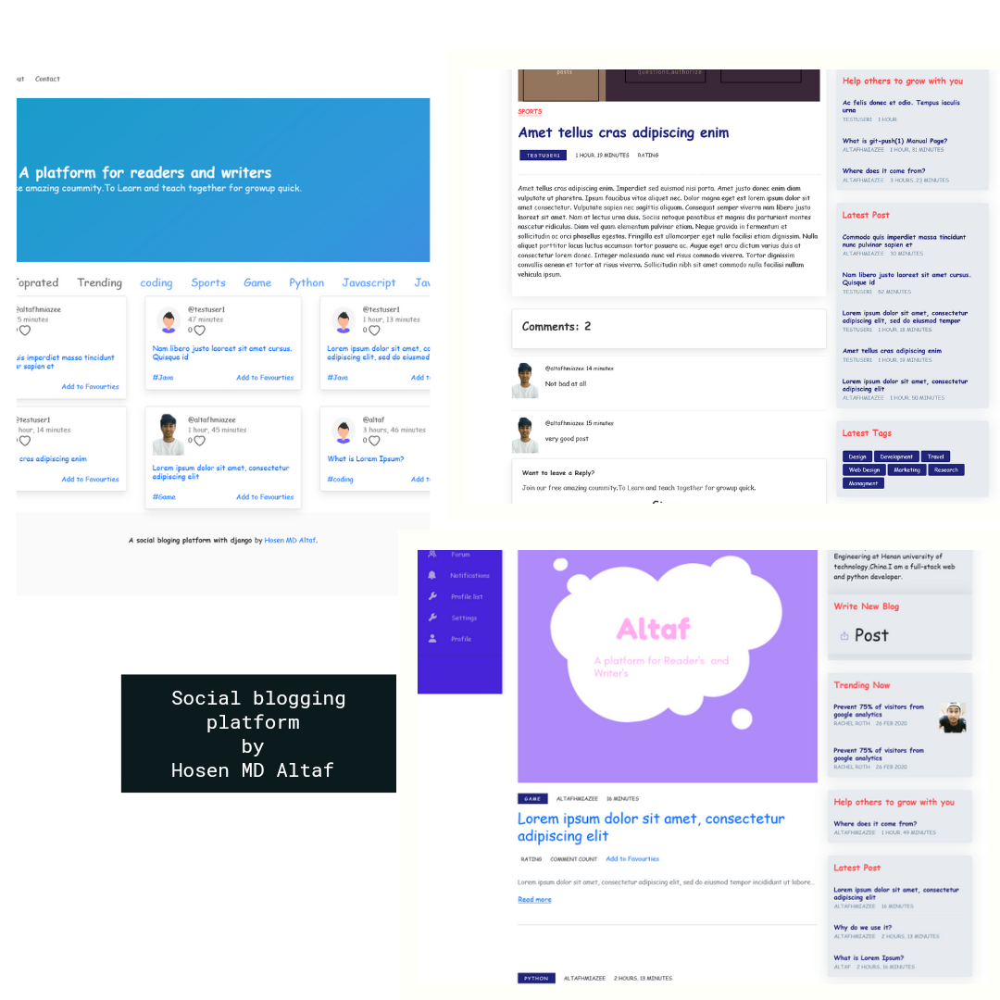

# Overview
In today's world, the internet is like a cell of our body. We cannot think a moment without the internet. As civilization goes on, people have spread all over the world. Without the internet, communication is impossible. At this point, we all depend on social platforms. Nowadays, social platform gives us everything we need from the internet such as educational videos and writing, news, funny posts etc. But lack of good news and trusted platforms are very rare.We always see our data leakage.  Almost all social platforms are missing of quality content, many fake news, fraud case all related to the social platforms. We spend most of our time on social sites, but at the end of the day, it is all about wasting our valuable time. So, I come up with the idea of a social blogging platform that will provide only quality content. This platform forces us to learn new things from the excellent writer, and we can ask questions if we want to learn. We want to develop an
association of helping hands. By resolving all the existing problems, it will be strict to security and user data.  After emerging our application, anyone can feel the success by creating something special. All the missing puzzles will be found here and playing no hide and seek with the users. This project will be an open source, and anyone can see what they are using. we see a lot of social media and blogging site.  Facebook, twitter, We Chat etc. are mainstream sites. For blogging medium, dev.to and many more names. In a while, I saw that there is a lot of missing puzzle in this system. As the best alternative for my project is medium or dev.to. But they do not have any solution for a direct communication system except commenting in a blog. The top social sites are disaster for quality reading. So I came up the idea of putting all of these missing puzzles together. In my application it will be full of quality content, there will be a super chance to grow up the community. It will provide a real-time messaging system and discussion forum for everyone, so anyone can get help if gets stuck. I also used Artificial intelligence for prediction, recommendation and suggestion. A recommendation system is important in our social life due to its strength in providing enhanced entertainment. the prediction will inspire writers as they get more audience in their blogs so they give us more satisfying blogs. In this project, I tried to show how Artificial intelligence involved in our real life as that we always reads in papers and everyone talking around I show the implementations with our blogs prediction and suggestion. This can be useful to predict making future decisions. It mines our databases to gather all the vital data, such as contents and title, required for the suggestion. It produces motion picture swarms not as it were helpful for a writer to select their niche for there and forced them to deliver good content for readers. Exploratory ponders on genuine information uncover the effectiveness and viability of our project.

# Introduction

This project is designed to meet the requirements of Social blogging community Site. It has been developed in django keeping in mind the specification of the system.
    • Using system analysis and design techniques like data flow diagram designing the system.
    • Understanding the database handling.
    • Understanding and applying the logic required for the pooling process.


**Altaf** is a social bloging platform that offers a unique experience offering a community for users interested in technology to communicate.

# Features
## Application features
    • An easy to use web application with a fully responsive design.
    • Full CRUD capabilities.
    • Fully functional Postgress and Reid’s database with restrictions and validation.
    • Sensitive data such as passwords are encrypted before adding to the database.
    • Fully responsive GUI to adapt to all screen sizes.
    • Created for readers and writers best experience in mind.
    • Server logging system.
    • Fully authenticated and authorization Secure for users

## User features
    • Can register an account.
    • Can log in.
    • Can stay Signing using local storage?
    • Can log out.
    • Can update profile info and profile image.
    • Can follow/unfollow other users.
    • Can get notifications different events
    • Can save there favourites  blogs.
    • Can view saved blogs.
    • Can add a blog.
    • Can update and delete own blog
    • Can comment on a blog.
    • Can chat with each other
    • Can ask question in discussion forum
    • Can update and delete own asked question
    • Can comment on another questions
    • Can search any question, blog, user
    • Can find blog by category
    • Can find latest blogs for read on feed
    • Can find trending blogs on there feed

# Technologies

<p align="center">
  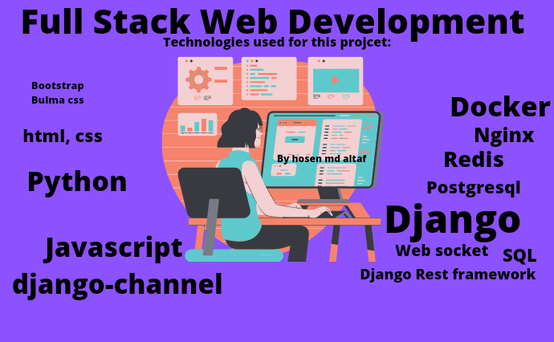
</p>

Below is a brief list of some of the technologies used. For a comprehensive list of dependencies see [here](https://github.com/hosenmdaltaf/Social-bloging-system-with-Django/blob/master/requirements.txt)

- **Languages**: 
    - JavaScript
    - HTML 
    - CSS
    - Python
- **Libraries**: 
    - Bootstrap
    - Bulma
    - Pandas
    - Sklearn
    - Numpy
- **Frameworks**: 
    - Django
    - Django Channels
- **Databases**:
    - postgresql
    - Redis
- **Environments**: 
    - windows
- **Development Software**
    - Docker
    - Visual Studio Code   
    - Git
    - Github

# Database design

**Database schema tables/models diagram** : <br/><br/>
* This diagram shows relations and dependent betweens each models 
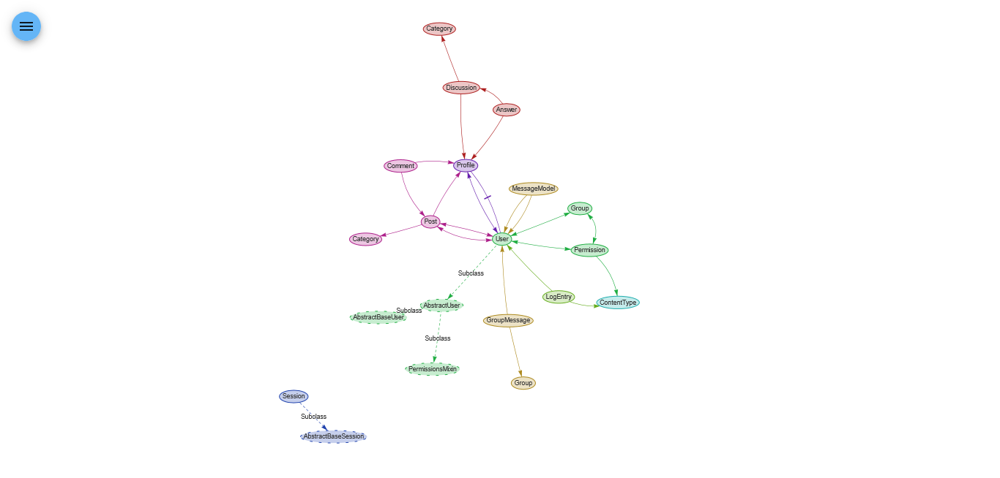

**Database schema diagram table fields** : <br/><br/>
> ⚠  Please note that multipoint,multipolygon feild is most of them actually ForeignKey and some of them are OneToOneField & ManyToManyField
* This diagram shows all the fields in each models/table


# Test our project

**Simple django unit test** : <br/><br/>
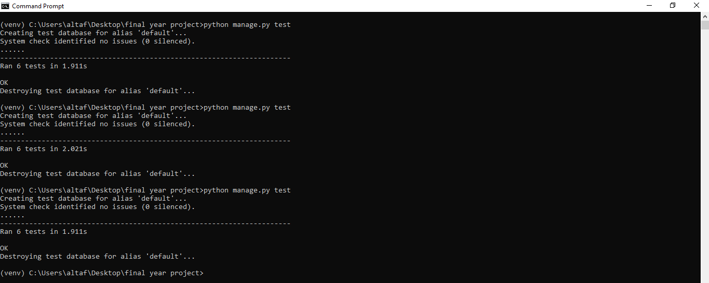

# Prerequisites
* python installed.
* Git or git bash to clone the project.
* Access to an internet browser.
* I highly recommend stay with django version 3.0 and python version 3.9.4(for avoiding any complicity)

# Deploy Project locally

## Download the Project
-> Clone this repository to your machine using the following command.
- Navigate to an empty directory
- In command prompt 

```bash
git clone https://github.com/hosenmdaltaf/Social-bloging-system-with-Django.git
# After cloning, move into the directory having the project files using the change directory command
cd Social-bloging-system-with-Django
```
-> Now create a virtual environment where all the required python packages will be installed
```bash
# Use this on Windows
py -3 -m venv env
# Use this on Linux and Mac
python -m venv env
```
-> Activate the virtual environment
```bash
# Windows
.\env\Scripts\activate
# Linux and Mac
source env/bin/activate
```
-> Install all the project Requirements
```bash
pip install -r requirements.txt
```
-> Finally, run the django development server
```bash
# apply migrations and create your database
python manage.py migrate

# Create a user with manage.py
python manage.py createsuperuser

# run django development server
python manage.py runserver
```

## Explore admin panel for model data or instances
http://127.0.0.1:8000/admin or http://localhost:8000/admin

<br/>

## Login with the user credentials you just created using createsuperuser command

<br />

> ⚠ If everything is good and has been done successfully, **Application** should be hosted on port 8000 i.e http://127.0.0.1:8000/ or http://localhost:8000/


<!-- # Deployment
This application is currently deployed on an AWS instance. Click [Here to TechBook live](http://34.243.30.50:3000/index) -->

# Preview
Below is a preview of some of the applications pages rendered on both a mobile device and PC.
_Please note these are the inital screenshots of the pages and may have changed by the time the project is submitted_. 


## 📸 Screenshots :

**Homepage** : <br/><br/>
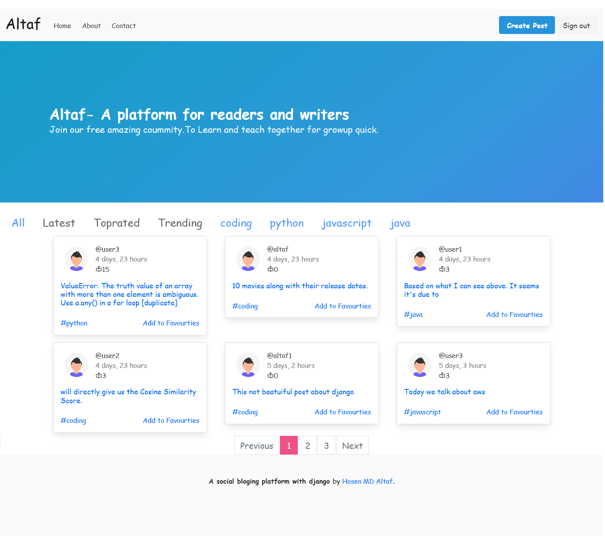

**User Feed** : <br/><br/>
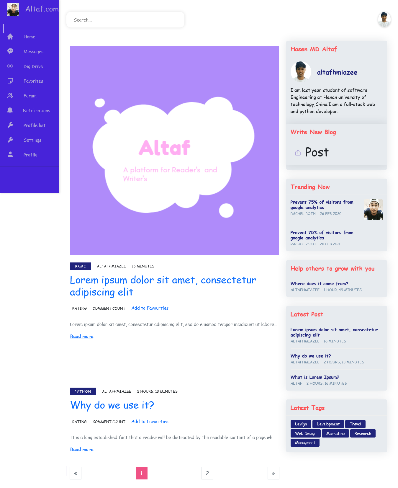

**User Profile Page** : <br/><br/>
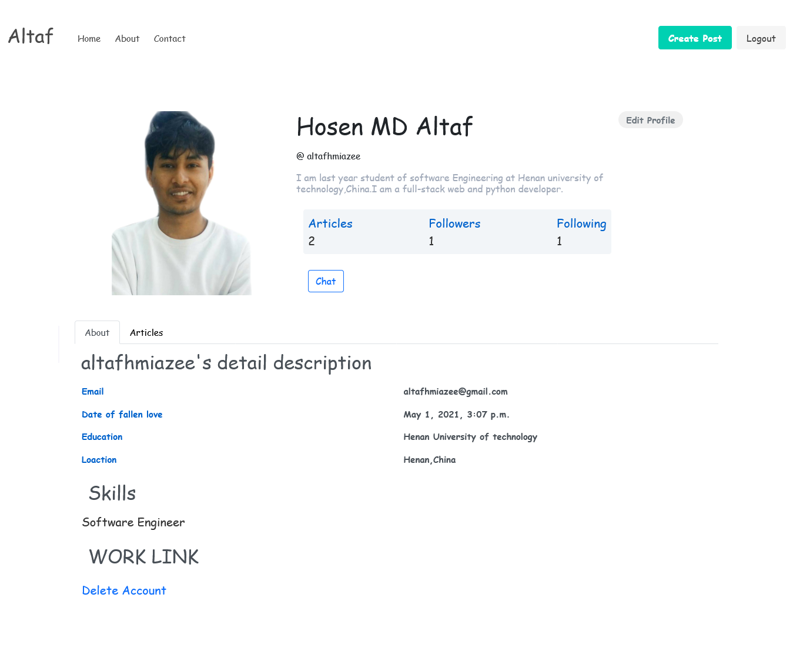

**Blogdetail Page** : <br/><br/>
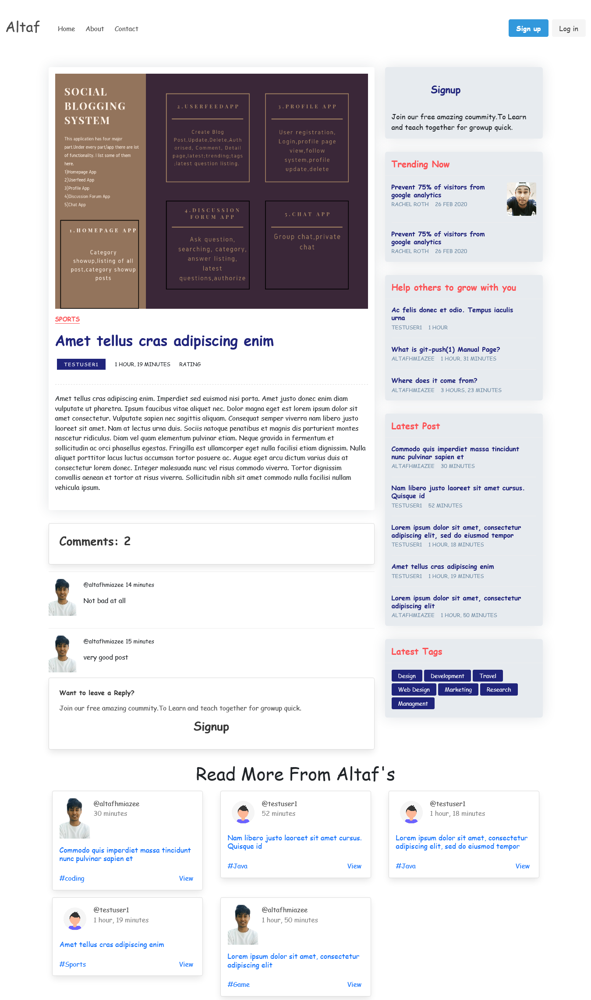

**Discussion/Question Page** : <br/><br/>
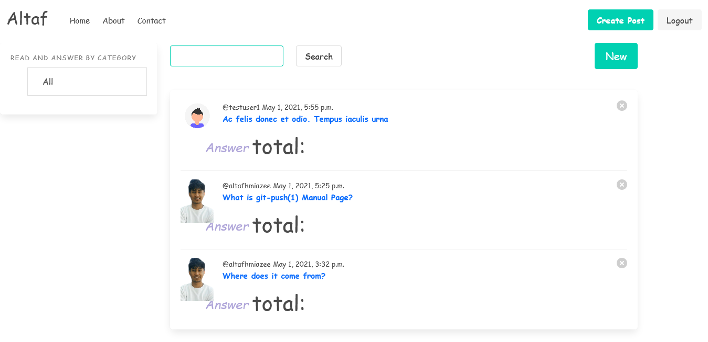

**Chat home Page** : <br/><br/>
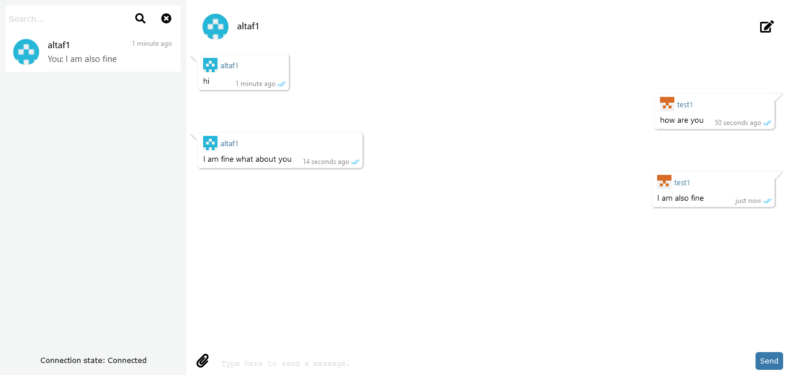

**Favourite Page** : <br/><br/>
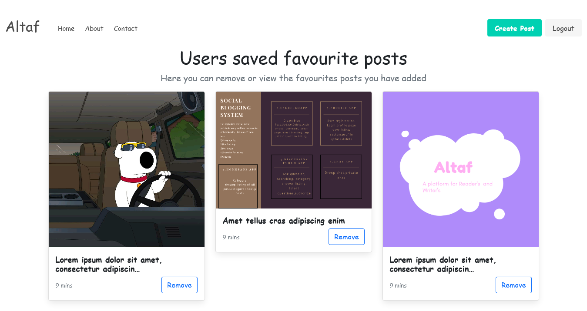

**Register Page** : <br/><br/>
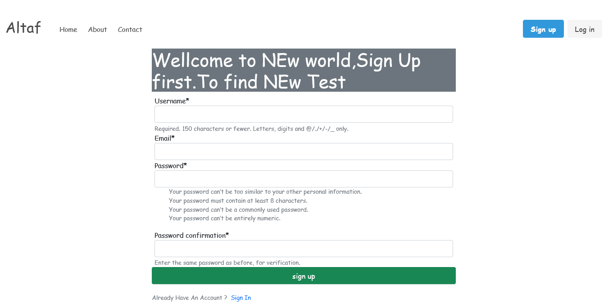

**Login Page** : <br/><br/>
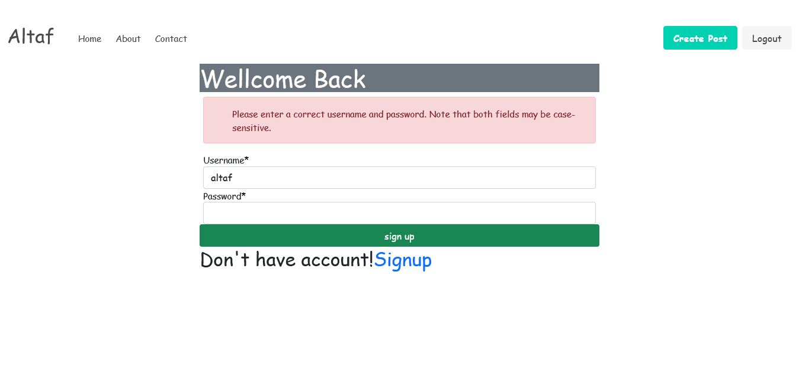

**Settings Page** : <br/><br/>
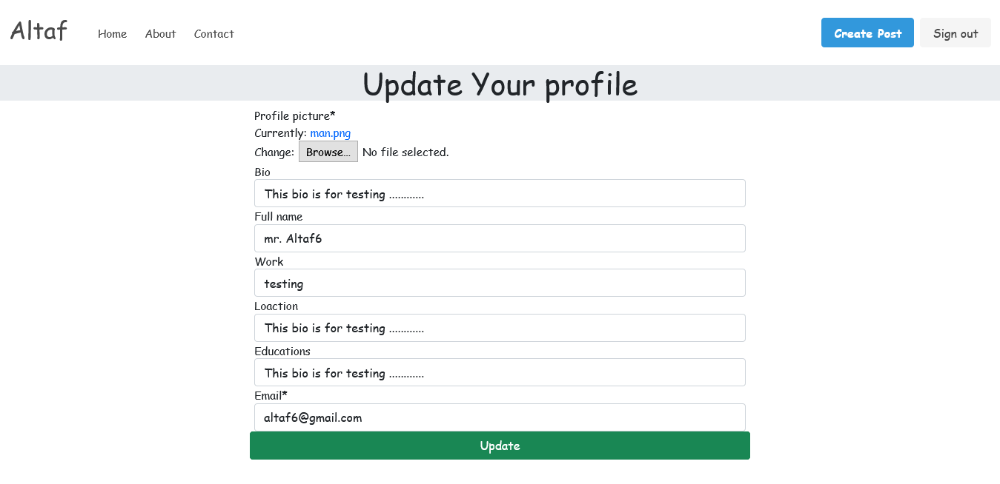

**Profilelist Page** : <br/><br/>
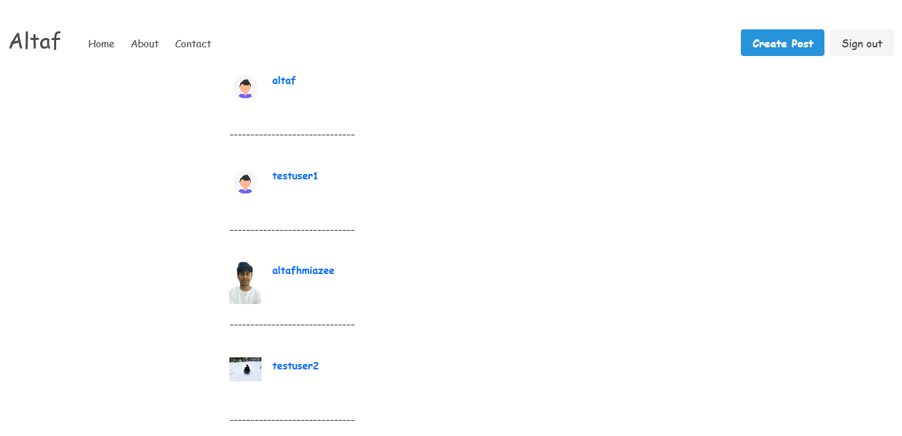


