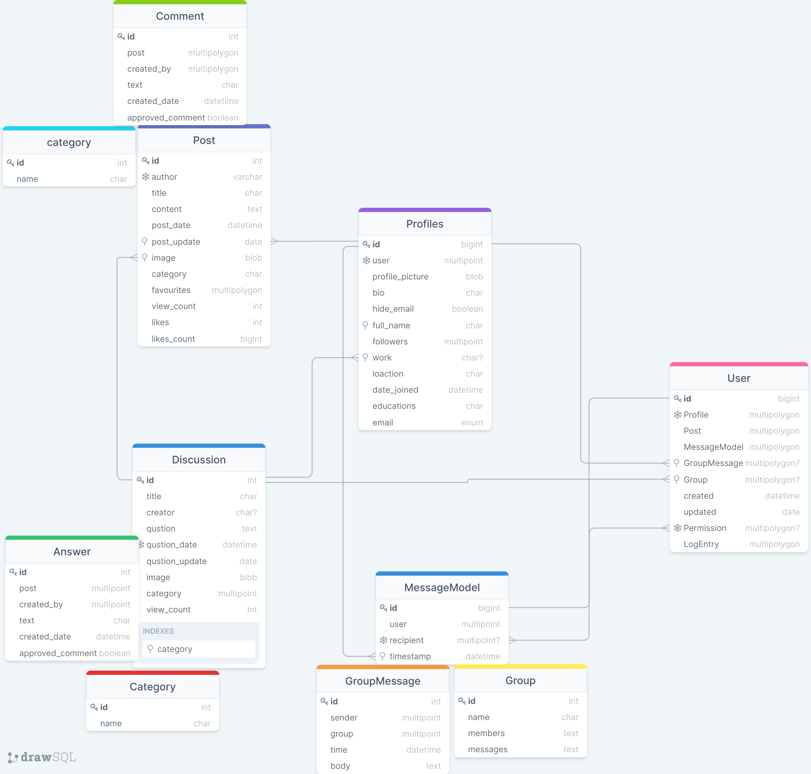
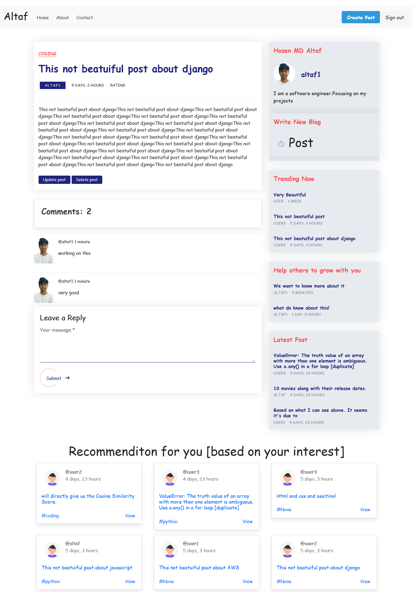

<h1 align="center">Social blogging community platform with Django</h1>

**Social bloging platform** : <br/><br/>


# Overview
Social media today plays an expanding significant role in society, the information technology industry and the field of computer science. The use of social media is a hot-topic for many organizations, with the aim to identify approaches in which companies can use applications to increase profits and grow product awareness. On a day-to-day basis, users from across the globe are becoming increasingly frustrated, wasting valuable time, scrolling through irrelevant content while companies are wasting money advertising to users outside their market.  In order to achieve the optimal benefits from social media, for both users and businesses, the development of these technologies require approaches that focus on specific human interests and values.


This project aims to deliver a solution by developing a platform with the goal of delivering a social experience that targets a specific user base. As the authors are in the field of computer science the focus of the content will be to appeal to the tech savvy user. The proposed solution will be a web application that will offer a unique online community to users and businesses interested in technology.

# Introduction

This project is designed to meet the requirements of Social blogging community Site. It has been developed in django keeping in mind the specification of the system.
    • Using system analysis and design techniques like data flow diagram designing the system.
    • Understanding the database handling.
    • Understanding and applying the logic required for the pooling process.


**Altaf** is a social bloging platform that offers a unique experience offering a community for users interested in technology to communicate.

# Features
## Application features
- An easy to use  web application with fully responsive design. 
- Full CRUD capabilities .
- Fully functional Postgress and redis database with restrictions and validation.
- Sensitive data such as passwords is encrypted before adding to database.
- Fully responsive GUI to adapt to all screen sizes.
- Created for readers and writers best experence in mind. 
- Server logging system.
- Fully aunthenticated and authorizatied Secure for users

## User features
- Can register an account.
- Can log in.
- Can stay logged in using local storage.
- Can log out.
- Can update profile info and upload profile image.
- Can follow / unfollow other users.
- Can subscribe / unsubscribe to blogs.
- Can view saved blogs.
- Can add a blog.
- Can update and delete own blog
- Can comment on blog.
- Can chat with each other
- Can ask question in disscussion forum
- Can update and delete own asked question
- Can comment on another questions
- Can search any question,blog,user 
- Can find blog by category
- Can find latest blogs for read on feed

# Technologies

<p align="center">
  
</p>

Below is a brief list of some of the technologies used. For a comprehensive list of dependencies see [here](https://github.com/hosenmdaltaf/Social-bloging-system-with-Django/blob/master/requirements.txt)

- **Languages**: 
    - JavaScript
    - HTML 
    - CSS
    - Python
- **Libraries**: 
    - Bootstrap
    - Bulma
- **Frameworks**: 
    - Django
    - Django REST framework
    - Django Channels
- **Databases**:
    - postgresql
    - Redis
- **Environments**: 
    - windows
- **Development Software**
    - Docker
    - Visual Studio Code   
    - Git
    - Github

# Database design

**Database schema tables/models diagram** : <br/><br/>
* This diagram shows relations and dependent betweens each models 


**Database schema diagram table fields** : <br/><br/>
> ⚠  Please note that multipoint,multipolygon feild is most of them actually ForeignKey and some of them are OneToOneField & ManyToManyField
* This diagram shows all the fields in each models/table


# Prerequisites
* python installed.
* Git or git bash to clone the project.
* Access to an internet browser.
* I highly recommend stay with django version 3.0 and python version 3.9.4(for avoiding any complicity)

# Deploy Project locally

## Download the Project
-> Clone this repository to your machine using the following command.
- Navigate to an empty directory
- In command prompt 

```bash
git clone https://github.com/hosenmdaltaf/Social-bloging-system-with-Django.git
# After cloning, move into the directory having the project files using the change directory command
cd Social-bloging-system-with-Django
```
-> Now create a virtual environment where all the required python packages will be installed
```bash
# Use this on Windows
py -3 -m venv env
# Use this on Linux and Mac
python -m venv env
```
-> Activate the virtual environment
```bash
# Windows
.\env\Scripts\activate
# Linux and Mac
source env/bin/activate
```
-> Install all the project Requirements
```bash
pip install -r requirements.txt
```
-> Finally, run the django development server
```bash
# apply migrations and create your database
python manage.py migrate

# Create a user with manage.py
python manage.py createsuperuser

# run django development server
python manage.py runserver
```

## Explore admin panel for model data or instances
http://127.0.0.1:8000/admin or http://localhost:8000/admin

<br/>

## Login with the user credentials you just created using createsuperuser command

<br />

> ⚠ If everything is good and has been done successfully, **Application** should be hosted on port 8000 i.e http://127.0.0.1:8000/ or http://localhost:8000/


<!-- # Deployment
This application is currently deployed on an AWS instance. Click [Here to TechBook live](http://34.243.30.50:3000/index) -->

# Preview
Below is a preview of some of the applications pages rendered on both a mobile device and PC.
_Please note these are the inital screenshots of the pages and may have changed by the time the project is submitted_. 


## 📸 Screenshots :

**Homepage** : <br/><br/>


**User Feed** : <br/><br/>


**User Profile Page** : <br/><br/>


**Blogdetail Page** : <br/><br/>


**Discussion/Question Page** : <br/><br/>


**Chat home Page** : <br/><br/>


**Favourite Page** : <br/><br/>


**Register Page** : <br/><br/>


**Login Page** : <br/><br/>


**Settings Page** : <br/><br/>


**Profilelist Page** : <br/><br/>


